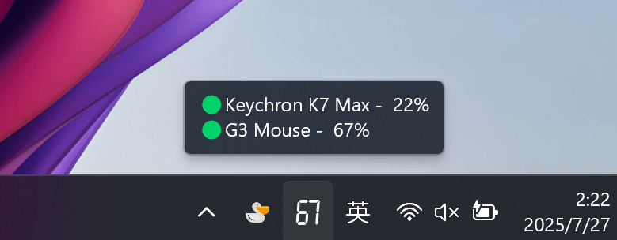

# BlueGauge
A lightweight tray tool for easily checking the battery level of your Bluetooth devices.

一款轻便的托盘工具，可轻松查看蓝牙设备的电池电量。

<h3 align="center"> 简体中文 | <a href='./README-en.md'>English</a></h3>

## 功能

- [x] 设置：蓝牙设备电量作为托盘图标    

    - 使用系统字体（默认）：  
        1. 勾选需显示电量设备，打开托盘菜单-`设置`-`打开配置`  
        2. 设置相关参数  
        `font_name` = `"系统字体名称，如 Microsoft YaHei UI"`（默认Arial）  
        `font_color` = `"十六进制颜色代码，如 #FFFFFF、#00D26A"`（默认为`FollowSystemTheme`，字体颜色跟随系统主题）  
        `font_size` = `0~64`  （默认`64`）   
        3. 重新启动 BlueGauge   

    

    - 使用自定义图片  
        在软件目录下创建一个`assets`文件夹，然后添加`0.png` 至 `100.png`照片即可 

- [x] 设置：开机自启动
- [x] 设置：更新信息间隔时间
- [x] 设置-提示：显示未连接的设备
- [x] 设置-提示：限制设备名称长度
- [x] 设置-提示：更改设备电量位置
- [x] 设置-通知：静音通知
- [x] 设置-通知：低电量时通知
- [x] 设置-通知：重新连接时通知
- [x] 设置-通知：断开连接时通知
- [x] 设置-通知：添加设备时通知
- [x] 设置-通知：移除设备时通知

## 已知问题与建议

### 1. 无法获取某些设备电量信息

目前，BlueGauge 可检索低功耗蓝牙设备（BLE）设备和经典蓝牙（Bluetooth Classic）设备的电量，但对于像 **AirPods** 和 **Xbox 控制器** 等使用专有通信协议的设备，可能无法获取电量信息。

- **解决方案：**: 欢迎有能力的开发者贡献代码或提供思路，帮助扩展对这些设备的支持。

### 2. 托盘提示文本被截断

托盘提示的字符长度有限，当设备名称过长时，提示文本会被截断，导致无法完整显示设备名称。尤其在连接多个设备时，设备名称可能不完整。

**建议的解决办法：**

1. **设置设备名称长度限制**：对设备名称的字符长度进行限制，确保其在托盘通知区域内完整显示。

2. **隐藏未连接的设备**：对于未连接的设备，可以考虑不在托盘通知中显示，从而减少杂乱，避免文本溢出。

## 其他蓝牙电量软件

1、苹果

2、华为

3、三星